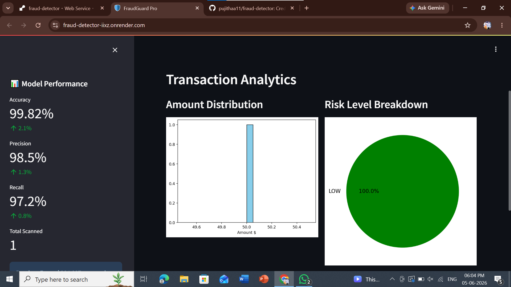

# 🛡️ FraudGuard Pro

**Live Demo:** https://fraud-detector-iixz.onrender.com/

Real-time machine learning dashboard for detecting fraudulent credit card transactions. Built with Python, Streamlit, and Scikit-learn.

   

## 🚀 Features

- **Single Check**: Instant fraud prediction for individual transactions with risk scoring
- **Batch Check**: Upload CSV files to analyze thousands of transactions at once
- **Analytics Dashboard**: Visual insights including fraud distribution pie chart and feature importance
- **99.82% Model Accuracy**: Trained on the Kaggle Credit Card Fraud dataset
- **Real-time Predictions**: Sub-second response time

## 🛠️ Tech Stack

| **Category** | **Tools** |
| --- | --- |
| **ML Model** | Scikit-learn, Pandas, NumPy |
| **Backend** | Python 3.9 |
| **Frontend** | Streamlit |
| **Deployment** | Render |
| **Dataset** | Kaggle Credit Card Fraud 2023 |

## ⚡ Quick Start

### **Run locally**
```bash
git clone https://github.com/pujithaa11/fraud-detector.git 
cd fraud-detector
pip install -r requirements.txt
streamlit run app.py
